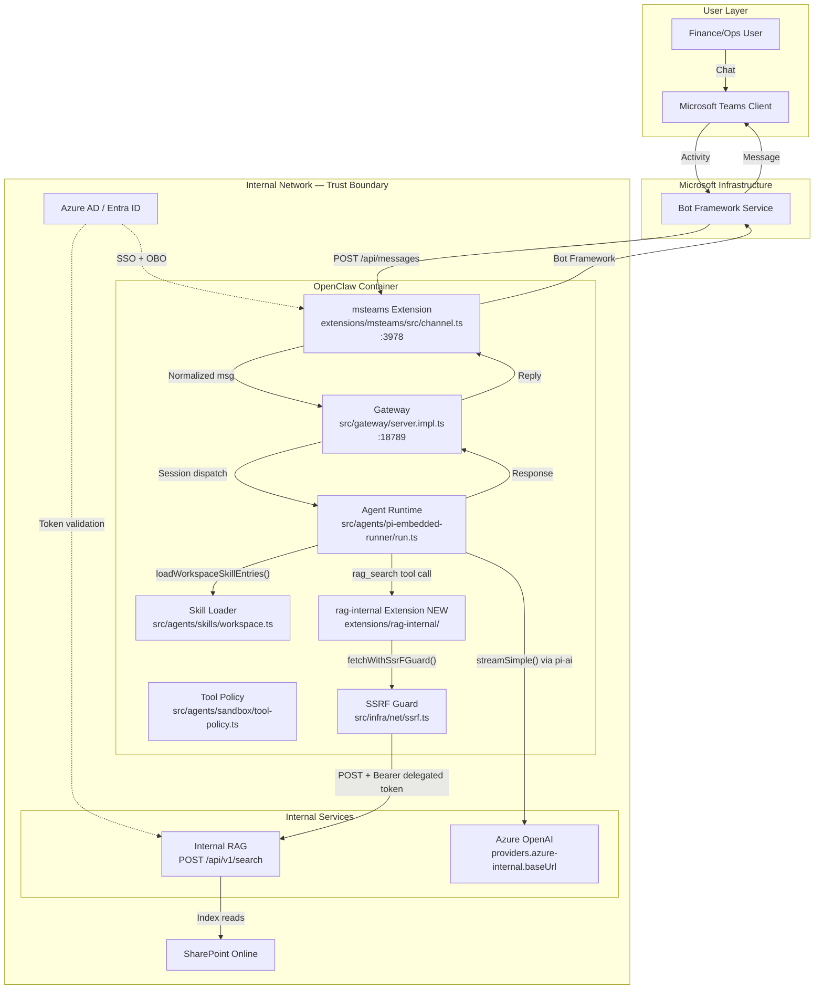

# 02 — Architecture

## System Diagram



## Code Path: Message to Response (For Implementers)

### Step 1: Inbound — Teams to Gateway

```
Bot Framework POSTs Activity JSON to msteams webhook
│
├─ extensions/msteams/src/monitor.ts
│   Receives Activity payload
│
├─ extensions/msteams/src/inbound.ts
│   normalizeMSTeamsConversationId(activity.conversation.id)  → strips ";messageid=..."
│   stripMSTeamsMentionTags(activity.text)                    → removes <at>...</at>
│   Extracts: activity.from.id, activity.from.name,
│             activity.conversation.conversationType
│
├─ extensions/msteams/src/monitor-handler/message-handler.ts
│   Checks dmPolicy + allowFrom via resolve-allowlist.ts
│   If "allowlist" + user not in allowFrom → reject
│   Else → route to Gateway via WebSocket
│
└─ src/gateway/server.impl.ts
    Receives normalized message → dispatches to agent session
```

### Step 2: Agent Execution — Skills, RAG, Model

```
src/agents/pi-embedded-runner/run.ts
│
├─ resolveModel("azure-internal", modelId, agentDir, config)
│   Location: src/agents/pi-embedded-runner/model.ts (~line 247)
│   → discoverModels(authStorage, agentDir) via src/agents/pi-model-discovery.ts
│   → ModelRegistry loads from models.providers.azure-internal in config
│   → Returns Model { baseUrl, api: "openai-completions", id, contextWindow, maxTokens }
│
├─ resolveSkillsPromptForRun(...)
│   Location: src/agents/skills/workspace.ts
│   → loadWorkspaceSkillEntries({ workspaceDir, cfg })
│       → Scans /opt/openclaw/mvp-skills/ (from cfg.skills.load.extraDirs)
│       → Parses each SKILL.md YAML frontmatter
│       → For each skill, calls shouldIncludeSkill() in src/agents/skills/config.ts
│           1. Checks skills.allowBundled — empty array blocks ALL bundled
│           2. extraDirs skills included if metadata.requires.* conditions pass
│   → buildWorkspaceSkillsPrompt() → generates skill listing for system prompt
│
├─ buildAgentSystemPrompt(...)
│   Location: src/agents/system-prompt.ts
│   Assembles in order: identity → skills → memory recall → user identity →
│   date/time → messaging → tools → workspace → extraSystemPrompt
│   The extraSystemPrompt is where citation/guardrail instructions go
│
├─ Agent reads selected SKILL.md → decides to invoke rag_search tool
│
├─ isToolAllowed(policy, "rag_search")
│   Location: src/agents/sandbox/tool-policy.ts
│   Deny list checked first (no match) → allow list checked (match) → ALLOWED
│
├─ rag_search tool executes (extensions/rag-internal/)
│   1. auth.ts: acquire delegated user token via OBO
│      Exchange bot token → Azure AD → delegated token with audience=RAG service
│   2. client.ts: POST to RAG endpoint
│      Uses fetchWithSsrFGuard() from src/infra/net/fetch-guard.ts
│      SSRF policy: hostnameAllowlist includes RAG host → allowed
│      Sends: Authorization: Bearer <delegated_token>, body: { query, filters }
│   3. RAG returns: { results: [{ chunk_id, document_url, chunk_text, relevance_score, metadata }] }
│
├─ Agent assembles model prompt
│   System prompt + RAG chunks formatted as [1], [2] markers + user question
│
└─ streamSimple() from @mariozechner/pi-ai
    Constructs HTTP request using model.baseUrl + model.api
    authStorage provides API key → set in headers
    Azure returns streaming SSE completion
    Agent processes response, formats with citations
```

### Step 3: Outbound — Gateway to Teams

```
Agent response text (with citation markers)
│
├─ src/gateway/server.impl.ts routes to msteams extension
│
├─ extensions/msteams/src/outbound.ts
│   Respects textChunkLimit (4000 chars, from channels.msteams.textChunkLimit)
│   Splits long responses into multiple messages
│   Sends via Bot Framework API
│
└─ User sees response in Teams
```

## Trust Boundaries

| Boundary | What Crosses | Code Enforcement | File Location |
|----------|-------------|-----------------|---------------|
| Teams → OpenClaw | Activity JSON (text + identity) | `appId`/`appPassword` validation; `dmPolicy`+`allowFrom` | `extensions/msteams/src/token.ts`, `resolve-allowlist.ts` |
| OpenClaw → Azure | Assembled prompt | API key auth; `models.mode: "replace"` | `src/agents/pi-embedded-runner/model.ts`, config |
| OpenClaw → RAG | Query + delegated token | OBO token + `fetchWithSsrFGuard()` with `hostnameAllowlist` | `extensions/rag-internal/src/client.ts` (NEW) |
| OpenClaw → Internet | **BLOCKED** | SSRF guard blocks non-allowlisted hosts | `src/infra/net/ssrf.ts`, `fetch-guard.ts` |

## Complete Deployment Config (openclaw.json)

A coding agent should produce this exact config structure:

```jsonc
{
  // === MODEL: Single Azure provider, all others disabled ===
  "models": {
    "mode": "replace",
    "providers": {
      "azure-internal": {
        "baseUrl": "${AZURE_OPENAI_BASE_URL}",
        "apiKey": "${AZURE_OPENAI_API_KEY}",
        "api": "openai-completions",
        "models": [{
          "id": "${AZURE_DEPLOYMENT_MODEL_ID}",
          "name": "Internal GPT-4",
          "contextWindow": 128000,
          "maxTokens": 4096,
          "input": ["text"],
          "compat": { "maxTokensField": "max_tokens" }
        }]
      }
    }
  },

  // === CHANNEL: Teams only, allowlisted users ===
  "channels": {
    "msteams": {
      "enabled": true,
      "appId": "${MSTEAMS_APP_ID}",
      "appPassword": "${MSTEAMS_APP_PASSWORD}",
      "tenantId": "${MSTEAMS_TENANT_ID}",
      "dmPolicy": "allowlist",
      "allowFrom": [],
      "groupPolicy": "disabled",
      "webhook": { "port": 3978 }
    }
  },

  // === SKILLS: Only MVP skills, all bundled blocked ===
  "skills": {
    "allowBundled": [],
    "load": { "extraDirs": ["/opt/openclaw/mvp-skills/"] }
  },

  // === TOOLS: Only rag_search allowed ===
  "tools": {
    "sandbox": {
      "tools": {
        "allow": ["rag_search"],
        "deny": ["exec", "process", "browser", "canvas", "nodes", "cron", "gateway"]
      }
    }
  },

  // === AGENT: Use Azure model ===
  "agents": {
    "defaults": {
      "model": { "primary": "azure-internal/${AZURE_DEPLOYMENT_MODEL_ID}" }
    }
  }
}
```

## Environment Variables (.env)

```bash
# Azure OpenAI
AZURE_OPENAI_BASE_URL=https://<internal-host>/openai/deployments/<deployment>/
AZURE_OPENAI_API_KEY=<key>
AZURE_DEPLOYMENT_MODEL_ID=<model-id>

# Internal RAG
RAG_ENDPOINT_URL=https://<rag-host>/api/v1/search
RAG_ENDPOINT_HOST=<rag-host>

# Azure AD (OBO token exchange)
AAD_CLIENT_ID=<bot-app-client-id>
AAD_CLIENT_SECRET=<bot-app-client-secret>
AAD_TENANT_ID=<tenant-id>
RAG_SERVICE_SCOPE=api://<rag-app-id>/.default

# Teams Bot
MSTEAMS_APP_ID=<bot-app-id>
MSTEAMS_APP_PASSWORD=<bot-app-password>
MSTEAMS_TENANT_ID=<tenant-id>
```

## Complete File Manifest

| Action | Path | What | Depends On | Doc |
|--------|------|------|-----------|-----|
| **CREATE** | `extensions/rag-internal/openclaw.plugin.json` | Plugin manifest | — | 03 |
| **CREATE** | `extensions/rag-internal/index.ts` | Registers `rag_search` tool | manifest | 03 |
| **CREATE** | `extensions/rag-internal/src/client.ts` | RAG HTTP client | types | 03, 06 |
| **CREATE** | `extensions/rag-internal/src/auth.ts` | OBO token exchange | — | 04 |
| **CREATE** | `extensions/rag-internal/src/types.ts` | RAG req/res types | — | 06 |
| **CREATE** | `extensions/rag-internal/src/prompt.ts` | System prompt additions | — | 07 |
| **CREATE** | `extensions/rag-internal/package.json` | Deps | — | — |
| **CREATE** | `mvp-skills/excel-formula-explain/SKILL.md` | Formula explain skill | — | 05 |
| **CREATE** | `mvp-skills/excel-table-summarize/SKILL.md` | Table summarize skill | — | 05 |
| **CREATE** | `mvp-skills/excel-variance-analysis/SKILL.md` | Variance analysis skill | — | 05 |
| **CREATE** | `mvp-skills/gl-line-mapper/SKILL.md` | GL mapper skill | — | 05 |
| **CREATE** | `mvp-skills/commentary-generator/SKILL.md` | Commentary skill | — | 05 |
| **CREATE** | `mvp-skills/document-qa/SKILL.md` | Document Q&A skill | — | 05 |
| **CREATE** | `mvp-skills/sanity-check/SKILL.md` | Sanity check skill | — | 05 |
| **CREATE** | `deploy/openclaw.json` | Locked-down config | All above | 02 |
| **CREATE** | `deploy/.env` | Secret env vars | Ops provides | 02 |
| **MODIFY** | `docker-compose.yml` | Mount config, skills, env; network rules | Config + skills | 02 |
