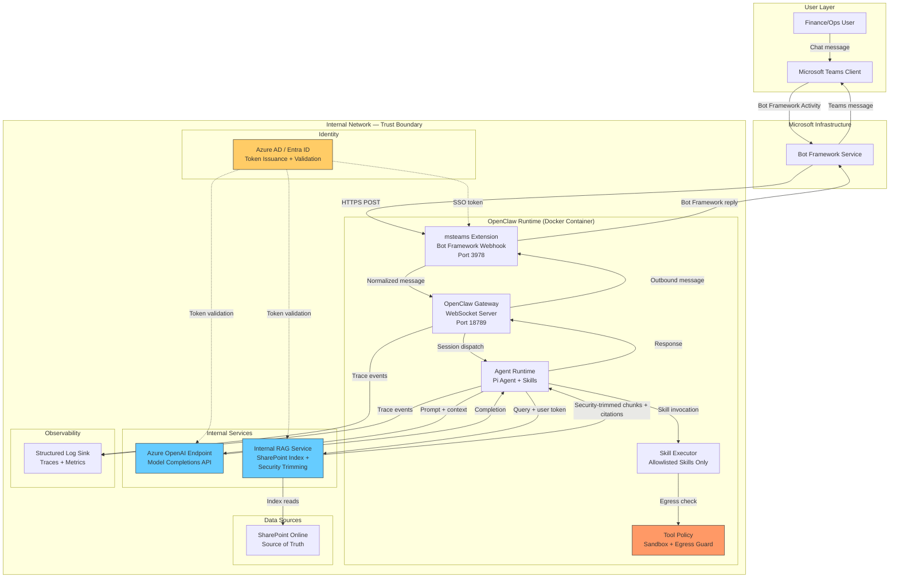

# 02 — Architecture

## System Overview

The MVP routes all intelligence calls through two internal endpoints: the Azure OpenAI model endpoint and the internal RAG service. OpenClaw acts as the orchestration layer, receiving user messages from Teams, invoking skills, querying RAG, calling the model, and returning responses — all within the internal network boundary.

## Architecture Diagram



## Trust Boundaries

| Boundary | What Crosses It | Controls |
|----------|----------------|----------|
| **User → Teams** | Chat messages, file references | Teams authentication (Azure AD SSO) |
| **Teams → Bot Framework → OpenClaw** | Bot Framework Activity JSON (text, mentions, attachments metadata) | `appId`/`appPassword` validation in `msteams` extension; `dmPolicy` and `allowFrom` access control |
| **OpenClaw → Azure Model Endpoint** | Assembled prompts (system prompt + user context + RAG chunks) | API key or managed identity auth; TLS; no raw user files in prompt — only extracted/chunked text |
| **OpenClaw → Internal RAG** | Search queries + delegated user token | Delegated auth token (on-behalf-of flow); RAG enforces SharePoint ACLs; TLS |
| **RAG → SharePoint** | Index reads | Service principal with read access; security trimming metadata synced from SharePoint permissions |
| **OpenClaw → External Internet** | **Nothing.** Blocked. | Container network policy; SSRF guard (`fetchWithSsrFGuard`); egress allowlist at firewall level |

## Data Flow Summary

1. **Inbound:** User sends message in Teams → Bot Framework routes to OpenClaw webhook (`/api/messages` on port 3978) → `msteams` extension normalizes to internal message format → Gateway dispatches to agent session.

2. **RAG Query:** Agent determines user intent via skill selection → constructs RAG query → calls internal RAG endpoint with user's delegated token → receives security-trimmed chunks with SharePoint `webUrl` citations.

3. **Model Call:** Agent assembles prompt: system instructions + skill context + RAG chunks (with citation markers) + user message → sends to Azure OpenAI endpoint via configured provider (`models.providers.azure-internal.baseUrl`) → receives completion.

4. **Outbound:** Agent formats response with inline citations → Gateway routes through `msteams` extension → Bot Framework delivers to Teams.

## Key Configuration Points

```jsonc
// openclaw.json — MVP provider config (illustrative, no real secrets)
{
  "models": {
    "mode": "replace",  // Do NOT merge with built-in public providers
    "providers": {
      "azure-internal": {
        "baseUrl": "https://<internal-azure-endpoint>/openai/deployments/<deployment>/",
        "auth": "api-key",
        "api": "openai-completions",
        "models": [
          {
            "id": "<deployment-model-id>",
            "name": "Internal GPT-4",
            "contextWindow": 128000,
            "maxTokens": 4096,
            "input": ["text"]
          }
        ]
      }
    }
  }
}
```

**Critical:** `"mode": "replace"` ensures no built-in public providers (Anthropic, OpenAI public, Gemini, etc.) are available. Only the explicitly configured `azure-internal` provider is reachable.

## Container Deployment

OpenClaw ships with a Dockerfile (Node 22-bookworm base). MVP deployment adds:

- **Network policy:** Container can only reach the internal Azure endpoint, internal RAG endpoint, and Bot Framework webhook URLs. All other egress is denied.
- **No volume mounts to host filesystem** beyond config and log directories.
- **Read-only filesystem** where possible; writable only for session state and logs.
- **No privileged mode.** Runs as non-root `node` user (existing Dockerfile default).
