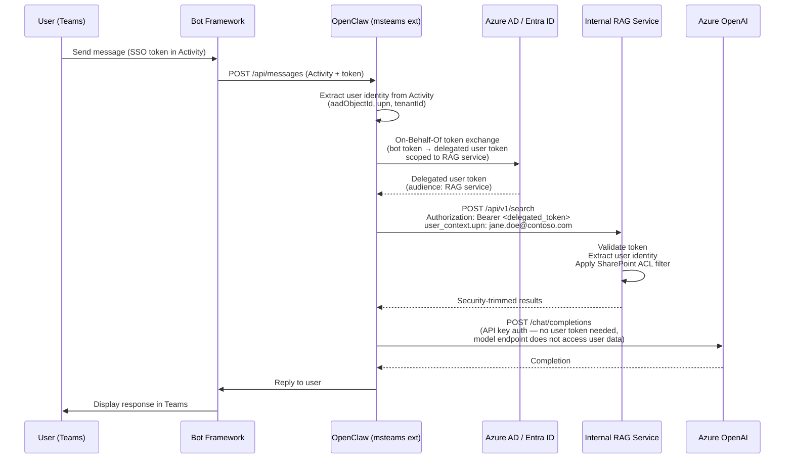

# 04 — Identity and Privilege Mirroring

## Overview

Every request from a user in Teams must carry that user's identity all the way through to the RAG service, so that SharePoint security trimming is enforced. The user must never see, summarize, or receive answers based on documents they cannot access in SharePoint.

## Identity Flow



## How User Identity Travels

### Step 1: Teams → OpenClaw

The `msteams` extension receives a Bot Framework `Activity` payload. Key identity fields:

| Activity Field | Maps To | Purpose |
|----------------|---------|---------|
| `from.aadObjectId` | Azure AD Object ID | Unique, immutable user identifier |
| `from.name` | Display name | Logging only (not used for auth) |
| `channelData.tenant.id` | Tenant ID | Multi-tenant validation |
| SSO token (via `tokenExchange`) | Azure AD access token | Delegated auth for downstream services |

OpenClaw's `msteams` extension already extracts these fields during inbound message normalization (see `extensions/msteams/src/inbound.ts`). The MVP adds: storing the SSO token (or acquiring one via OBO) in the session context for downstream calls.

### Step 2: OpenClaw → RAG Service (Delegated Auth)

OpenClaw exchanges the bot's token for a delegated user token using the **On-Behalf-Of (OBO)** flow:

1. OpenClaw presents the user's SSO token to Azure AD.
2. Azure AD issues a new token with `audience` set to the RAG service's app registration.
3. This delegated token carries the user's identity and permissions.
4. OpenClaw sends this token in the `Authorization` header of RAG requests.

**Token caching:** Delegated tokens are cached per-user per-session with a TTL slightly shorter than the token's `exp` claim. Token refresh happens transparently before expiry.

### Step 3: RAG Service Enforces Security Trimming

The RAG service is responsible for:

1. **Validating the delegated token** — checking signature, audience, issuer, and expiry.
2. **Extracting user identity** — `oid` (object ID) and `upn` (user principal name) from token claims.
3. **Applying SharePoint ACLs** — only returning chunks from documents the user has at least Read access to in SharePoint.
4. **Supplemental UPN check** — the `user_context.upn` field in the request body serves as a cross-check against the token's `upn` claim. If they don't match, the request is rejected.

### Step 4: OpenClaw → Azure Model Endpoint

The model endpoint does **not** receive user identity tokens. It authenticates OpenClaw as a service (via API key or managed identity). User data that reaches the model is limited to:
- The assembled prompt (system instructions + RAG chunks + user question)
- No raw files, no user tokens, no SharePoint URLs in the prompt itself (citations are added post-completion)

## The Security Trimming Guarantee

### Contract with the RAG Service

OpenClaw **delegates** security trimming entirely to the RAG service. The contract:

| Guarantee | Owner | Verification |
|-----------|-------|-------------|
| Delegated token accurately represents the requesting user | OpenClaw (via OBO flow) | Token claims match Teams Activity identity |
| RAG results only include documents the user can access in SharePoint | RAG service | RAG service checks SharePoint permissions via Microsoft Graph or cached ACL index |
| No document content is returned for items the user lacks Read access to | RAG service | Integration test: query as User A for doc only User B can access → 0 results |
| Token validation rejects expired, malformed, or wrong-audience tokens | RAG service | Standard Azure AD token validation middleware |

### What OpenClaw Does NOT Do

- OpenClaw does **not** independently verify SharePoint permissions.
- OpenClaw does **not** filter RAG results after receiving them.
- OpenClaw **trusts** the RAG service to enforce security trimming correctly.
- OpenClaw **does** verify that the token exchange succeeded and that the delegated token's `upn` matches the session user.

## Failure Modes and User-Facing Messages

| Failure | Detection | User Message | Internal Action |
|---------|-----------|-------------|-----------------|
| SSO token not available in Teams Activity | `tokenExchange` returns null or error | "I need to verify your identity. Please try sending your message again. If this persists, sign out and back into Teams." | Log `auth_failure:sso_unavailable` with `hashed_user_id` |
| OBO token exchange fails | Azure AD returns error (e.g., consent not granted) | "I'm unable to verify your access permissions. Please contact your admin — they may need to approve this app." | Log `auth_failure:obo_exchange` with error code |
| Delegated token expired mid-session | RAG returns 401 | "Your session has expired. Please send your question again to re-authenticate." | Clear cached token; next request triggers fresh OBO flow |
| UPN mismatch (token vs. request) | RAG returns 403 with `upn_mismatch` error | "There was an identity verification error. Please try again." | Log `auth_failure:upn_mismatch` as security event; alert ops |
| User has no access to any matching documents | RAG returns 200 with empty results | "I searched for relevant documents but didn't find any you have access to. You may need to request access to the relevant SharePoint library." | Log `rag_empty:no_access` — distinguish from "no results found" |
| RAG service unavailable | RAG returns 500/503 or timeout | "I'm having trouble accessing documents right now. Please try again in a moment." | Log `rag_error:service_unavailable`; retry 2x with backoff |

## Session Identity Cache

To avoid repeated OBO token exchanges for every RAG call within a conversation:

```
Session Store (per user, per conversation):
  - aad_object_id: string        (from Teams Activity)
  - upn: string                  (from Teams Activity)
  - delegated_token: string      (from OBO exchange)
  - token_expiry: timestamp      (from token exp claim)
  - last_validated: timestamp    (last successful RAG call)
```

Token is refreshed when `token_expiry - now < 5 minutes`. Session is invalidated if the Teams Activity's `aadObjectId` changes (should never happen within a conversation, but defensive check).

## Audit Requirements

Every RAG call must be logged with:

| Field | Purpose |
|-------|---------|
| `trace_id` | Correlation across the full request lifecycle |
| `hashed_user_id` | SHA-256 of `aadObjectId` — for usage analytics without storing PII in logs |
| `upn_hash` | SHA-256 of UPN — for cross-referencing with RAG audit logs |
| `rag_query_id` | Returned by RAG service — for RAG-side audit trail |
| `documents_returned` | Count of chunks returned |
| `document_ids` | List of `document_id` values (SharePoint item IDs, not content) |
| `auth_method` | `obo_delegated` or `fallback` |
| `token_age_seconds` | How old the cached delegated token was at time of use |
