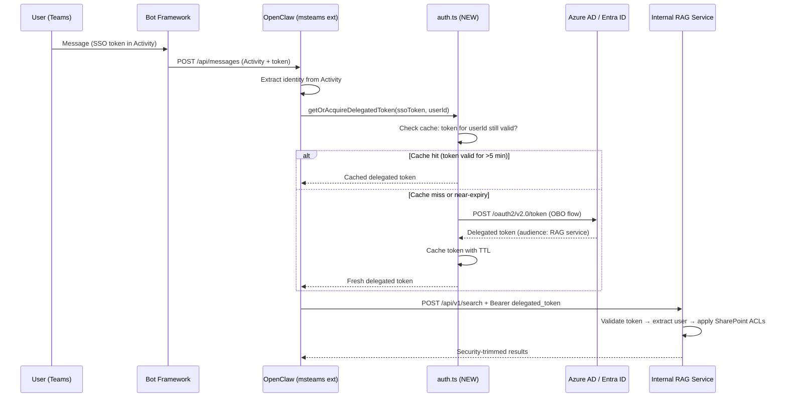

# 04 — Identity and Privilege Mirroring

## Implementation Target

**File to create:** `extensions/rag-internal/src/auth.ts`

This module acquires delegated user tokens via the On-Behalf-Of (OBO) flow and caches them per-user per-session.

## Identity Flow



## Step 1: Teams Activity → User Identity

**Already implemented in:** `extensions/msteams/src/inbound.ts` and `extensions/msteams/src/monitor-handler/message-handler.ts`

Identity fields available from the Bot Framework Activity:

| Activity Field | Usage | Available Today? |
|----------------|-------|-----------------|
| `from.id` | Teams user ID | Yes — extracted in `message-handler.ts` |
| `from.name` | Display name | Yes — used in logging |
| `from.aadObjectId` | Azure AD Object ID | Yes — if populated by Bot Framework |
| `channelData.tenant.id` | Tenant ID | Yes |
| SSO token | Via `tokenExchange` invoke or OAuth card | **Must implement** — see below |

**What a coding agent must add:** The msteams extension must handle the `tokenExchange` invoke to acquire the user's SSO token. This may require adding a handler in the monitor-handler directory, or using the Bot Framework SDK's built-in SSO support.

## Step 2: OBO Token Exchange (`extensions/rag-internal/src/auth.ts`)

### Implementation Specification

```typescript
// extensions/rag-internal/src/auth.ts

import { createSubsystemLogger } from "openclaw/plugin-sdk";

const logger = createSubsystemLogger("rag-internal:auth");

type CachedToken = {
  token: string;
  expiresAt: number;      // ms since epoch
  acquiredAt: number;
};

// In-memory cache: userId → CachedToken
const tokenCache = new Map<string, CachedToken>();

// Environment variables (resolved from .env)
const AAD_CLIENT_ID = process.env.AAD_CLIENT_ID!;
const AAD_CLIENT_SECRET = process.env.AAD_CLIENT_SECRET!;
const AAD_TENANT_ID = process.env.AAD_TENANT_ID!;
const RAG_SERVICE_SCOPE = process.env.RAG_SERVICE_SCOPE!; // e.g., "api://<rag-app-id>/.default"
const TOKEN_URL = `https://login.microsoftonline.com/${AAD_TENANT_ID}/oauth2/v2.0/token`;

export async function getDelegatedToken(
  userSsoToken: string,
  userId: string,
): Promise<string> {
  // 1. Check cache
  const cached = tokenCache.get(userId);
  if (cached && cached.expiresAt - Date.now() > 5 * 60 * 1000) {
    return cached.token;
  }

  // 2. OBO token exchange
  const body = new URLSearchParams({
    grant_type: "urn:ietf:params:oauth:grant-type:jwt-bearer",
    client_id: AAD_CLIENT_ID,
    client_secret: AAD_CLIENT_SECRET,
    assertion: userSsoToken,
    scope: RAG_SERVICE_SCOPE,
    requested_token_use: "on_behalf_of",
  });

  const response = await fetch(TOKEN_URL, {
    method: "POST",
    headers: { "Content-Type": "application/x-www-form-urlencoded" },
    body: body.toString(),
  });

  if (!response.ok) {
    const error = await response.text();
    logger.error("OBO token exchange failed", { userId, status: response.status });
    throw new OboTokenError(response.status, error);
  }

  const data = await response.json();
  const token = data.access_token;
  const expiresIn = data.expires_in; // seconds

  // 3. Cache
  tokenCache.set(userId, {
    token,
    expiresAt: Date.now() + expiresIn * 1000,
    acquiredAt: Date.now(),
  });

  return token;
}

export function clearTokenCache(userId: string): void {
  tokenCache.delete(userId);
}

export class OboTokenError extends Error {
  constructor(public status: number, public detail: string) {
    super(`OBO token exchange failed: ${status}`);
    this.name = "OboTokenError";
  }
}
```

### Dependencies

- `fetch` — Node 22 built-in (no additional package needed)
- `login.microsoftonline.com` must be in the SSRF allowlist and container egress allowlist

### Alternative: Use MSAL

If the team prefers using the official Microsoft library:

```bash
npm install @azure/msal-node
```

Use `ConfidentialClientApplication.acquireTokenOnBehalfOf()` instead of raw HTTP. This handles token caching, retry, and error parsing. The implementation above avoids the dependency for simplicity.

## Step 3: Connecting Auth to the RAG Client

In `extensions/rag-internal/src/tool.ts`, the `rag_search` tool handler:

1. Extracts the user's SSO token from the session/context (passed from msteams extension).
2. Calls `getDelegatedToken(ssoToken, userId)` from `auth.ts`.
3. Passes the delegated token to `searchRag(request, delegatedToken)` from `client.ts`.
4. If `searchRag()` returns 401, calls `clearTokenCache(userId)` and retries once.

## Security Trimming Guarantee

| Guarantee | Owner | Implementation |
|-----------|-------|---------------|
| Delegated token represents the requesting user | `auth.ts` (OBO flow) | Token's `oid` + `upn` claims match the Teams Activity identity |
| RAG results respect SharePoint ACLs | RAG service | RAG validates token and filters results by user permissions |
| Expired/invalid tokens are rejected | RAG service | Standard Azure AD token validation |
| UPN in request body matches token UPN | RAG service | Cross-check `user_context.upn` against token claim |

**OpenClaw does NOT independently verify SharePoint permissions.** It delegates entirely to the RAG service via the delegated token.

## Failure Modes

| Failure | Detection Point | User Message | Code Action |
|---------|----------------|-------------|-------------|
| SSO token unavailable | `tokenExchange` handler in msteams extension | "I need to verify your identity. Please try again." | Log `auth_failure:sso_unavailable` |
| OBO exchange fails | `auth.ts` → `OboTokenError` | "I'm unable to verify your access. Please contact your admin." | Log `auth_failure:obo_exchange` with status code |
| Token expired mid-session | `client.ts` gets 401 from RAG | "Your session expired. Please send your question again." | `clearTokenCache(userId)` + retry once |
| UPN mismatch | RAG returns 403 | "Identity verification error. Please try again." | Log as **security event** + alert |
| No accessible documents | RAG returns 200 + empty results | "I didn't find documents you have access to for this query." | Log `rag_empty:no_access` |

## Audit Fields (Emitted by `rag_search` Tool)

Every RAG call logs (via `createSubsystemLogger("rag-internal")`):

```typescript
logger.info("rag_search", {
  trace_id,
  hashed_user_id: sha256(aadObjectId),
  rag_query_id: response.query_id,
  document_ids: response.results.map(r => r.document_id),
  chunk_count: response.results.length,
  auth_method: "obo_delegated",
  token_age_seconds: Math.floor((Date.now() - cachedToken.acquiredAt) / 1000),
});
```
