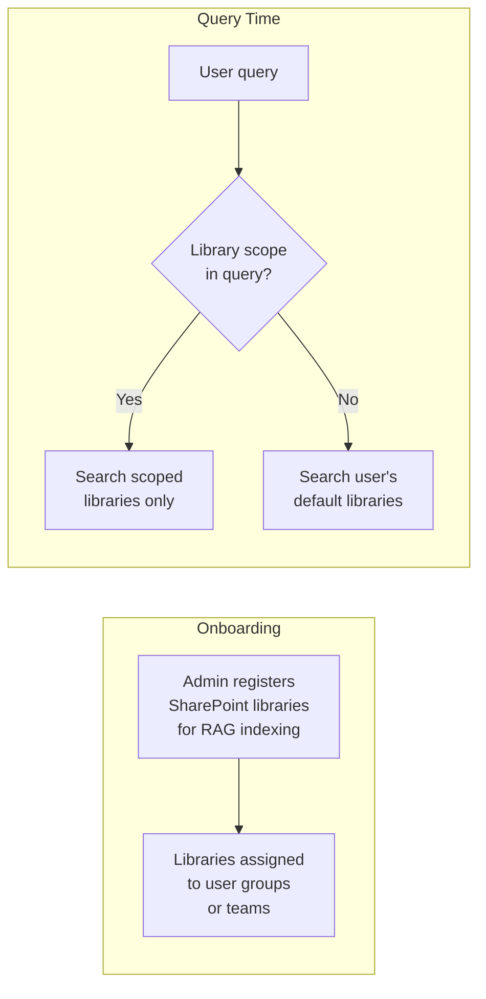

# 06 — RAG Contract

## Implementation Target

**File:** `extensions/rag-internal/src/client.ts` — implements the HTTP client that calls this contract.
**Types:** `extensions/rag-internal/src/types.ts` — TypeScript types matching this contract (defined in doc 03).
**Chunk budgeting:** `extensions/rag-internal/src/tool.ts` — the `rag_search` tool handler that processes RAG results before passing to the model.

## Overview

The internal RAG service is the sole pathway for OpenClaw to access organizational documents. It indexes SharePoint, enforces security trimming, and returns text chunks with citations. This document defines the exact contract between OpenClaw and the RAG service.

## What RAG Returns

Each RAG response contains an array of **chunks** — extracted text segments from SharePoint-hosted documents. Every chunk includes:

### Chunk Schema

```json
{
  "chunk_id": "string — unique identifier for this chunk",
  "document_id": "string — SharePoint item ID",
  "document_title": "string — human-readable file name",
  "document_url": "string — SharePoint webUrl (REQUIRED for citations)",
  "library": "string — SharePoint document library name",
  "chunk_text": "string — extracted text content, max ~2000 characters",
  "chunk_index": "integer — position of this chunk within the document (0-based)",
  "total_chunks": "integer — total chunks extracted from this document",
  "relevance_score": "float — 0.0 to 1.0, higher is more relevant",
  "metadata": {
    "file_type": "string — .xlsx, .csv, .docx, .pdf, .pptx",
    "sheet_name": "string | null — Excel sheet name if applicable",
    "cell_range": "string | null — Excel cell range if applicable (e.g., A1:F45)",
    "page_number": "integer | null — PDF/PPTX page number if applicable",
    "section_heading": "string | null — document section heading if detectable",
    "last_modified": "ISO 8601 — last modified timestamp",
    "last_modified_by": "string — display name of last editor",
    "dlp_labels": ["string — DLP sensitivity labels, if any"],
    "content_type": "string — table | text | formula | mixed"
  }
}
```

### Required Fields for Citation

OpenClaw **requires** the following fields to construct user-facing citations:

| Field | Usage | Fallback if Missing |
|-------|-------|-------------------|
| `document_url` | Primary citation link — must be a valid SharePoint `webUrl` that the user can click to open the source | **Fail the citation.** Display chunk text with "[Source unavailable]" warning. Log `citation_missing_url`. |
| `document_title` | Display text for the citation link | Use `document_id` as fallback display text |
| `metadata.sheet_name` | For Excel files: "Sheet: COGS Detail" appended to citation | Omit sheet reference |
| `metadata.cell_range` | For Excel files: "(A1:F45)" appended to citation | Omit range reference |
| `metadata.page_number` | For PDF/PPTX: "Page 3" appended to citation | Omit page reference |

### Citation Format in Responses

OpenClaw formats citations as Markdown links in the response:

```
The Q3 COGS variance was driven by a 12% increase vs. budget, primarily from
raw material price escalation in copper (+18% YoY).
[Q3 2025 Variance Analysis.xlsx — Sheet: COGS Detail](https://contoso.sharepoint.com/sites/finance/...)
```

## Handling Excel Files

Excel files in SharePoint present unique challenges for RAG. The contract requires:

### Table Extraction

| Requirement | Description |
|-------------|-------------|
| **Structured extraction** | Excel tables must be extracted with column headers preserved. Chunks should represent logical table segments (e.g., one sheet section), not arbitrary byte ranges. |
| **Header propagation** | If a table spans multiple chunks, each chunk must include the column headers so the chunk is self-contained. |
| **Cell references** | `metadata.cell_range` must accurately reflect the source cells for the chunk. |
| **Formula values** | Chunks contain **computed values**, not formula text. The RAG service extracts what the cell displays, not `=SUM(B2:B50)`. |
| **Named ranges/tables** | If the Excel file uses named tables or ranges, `metadata.section_heading` should reflect the table name. |

### Large Excel Files

| Scenario | RAG Behavior | OpenClaw Handling |
|----------|-------------|-------------------|
| File has >50 sheets | RAG indexes all sheets; returns chunks from most relevant sheets for the query | OpenClaw may issue follow-up queries scoped to specific sheets if initial results are insufficient |
| Single sheet has >10,000 rows | RAG chunks into segments of ~100–500 rows, each with headers | OpenClaw may need multiple RAG calls to assemble a complete picture; chunk budgeting in model contract (doc 07) limits total context |
| File is >50MB | RAG indexes asynchronously; may not be available immediately after upload | OpenClaw surfaces "This file is still being processed" if `document_id` exists but no chunks are available |
| Pivot tables | RAG extracts the displayed values of pivot tables, not the underlying data | OpenClaw treats pivot table chunks like any other table data |

### CSV Files

Treated as single-sheet Excel files. Column headers are extracted from the first row. `metadata.sheet_name` is null. `metadata.cell_range` reflects row ranges.

## Handling Large Documents (Non-Excel)

| File Type | Chunking Strategy | Max Chunks per Document |
|-----------|------------------|------------------------|
| `.docx` | By section/heading or ~1500 characters | 50 |
| `.pdf` | By page, then by ~1500 characters within page | 100 |
| `.pptx` | By slide | 100 |
| `.xlsx` | By sheet, then by table/range segments | 200 |
| `.csv` | By row groups with header propagation | 100 |

**Assumption [A6]:** These chunking limits are configurable in the RAG service. The numbers above are reasonable defaults; confirm with the RAG team.

## Preventing "RAG Everything" → "RAG Anything"

Unconstrained RAG access creates risk: a user could use the assistant to trawl every document they have access to across the entire SharePoint tenant. While security trimming prevents unauthorized access, unrestricted queries against the full tenant index create noise, latency, and potential for information overload.

### Scoping Strategy



| Control | Description |
|---------|-------------|
| **Library allowlist** | Only SharePoint document libraries that have been explicitly registered with the RAG service are indexed. Not the entire tenant. |
| **Default scope per user/team** | Each pilot user or team has a default set of libraries (e.g., "finance-models", "budget-2025", "monthly-close"). Queries without explicit scope search only these defaults. |
| **Explicit scope override** | Users can reference specific libraries or documents in their query (e.g., "search in the Q3 close folder"). OpenClaw passes this as `filters.libraries` in the RAG request. |
| **Max results cap** | RAG returns at most 25 chunks per query. OpenClaw typically requests 10. |
| **No full-document dump** | The RAG API does not support "return the entire document." It returns relevant chunks only. If a user needs the full file, they go to SharePoint directly (the citation link takes them there). |

### Onboarding Process for New Libraries

1. Team lead or admin requests a new SharePoint library be added to the RAG index.
2. RAG service admin adds the library to the indexing configuration.
3. Initial indexing runs (may require hours for large libraries).
4. Library is added to the relevant team's default scope in OpenClaw config.
5. Users in that team can now query documents in the new library.

**No self-service library registration in MVP.** This is an admin operation.

## Confidence and Relevance

| Score Range | Interpretation | OpenClaw Behavior |
|-------------|---------------|-------------------|
| 0.80–1.00 | High confidence | Use chunk directly in context |
| 0.50–0.79 | Medium confidence | Include but note lower confidence to the model via system prompt |
| 0.20–0.49 | Low confidence | Include only if fewer than 3 high/medium results available |
| 0.00–0.19 | Noise | Discard — do not include in model context |

**Minimum score threshold:** OpenClaw sends `min_score: 0.3` in RAG requests by default. Adjustable per-skill if needed.

## RAG Response Size Budget

To fit within model context limits (see doc 07), OpenClaw enforces a chunk budget:

| Parameter | Default | Configurable |
|-----------|---------|-------------|
| Max chunks per model call | 8 | Yes |
| Max total chunk text | ~16,000 characters (~4,000 tokens) | Yes |
| Max chunks from single document | 4 | Yes (prevents one document dominating context) |

If RAG returns more chunks than the budget allows, OpenClaw:
1. Sorts by `relevance_score` descending.
2. Takes top N chunks up to the budget.
3. Ensures at least 2 source documents are represented (if available).

## Error Contract

| RAG Response | Meaning | OpenClaw Action |
|-------------|---------|-----------------|
| 200 + empty `results` | No matching documents or user has no access | "I didn't find any relevant documents for your query. Try being more specific, or check that the documents are in a library I can search." |
| 200 + `truncated: true` | More results available than `max_results` | Inform model: "Note: additional results were available but not included." |
| 200 + chunks with no `document_url` | RAG bug — URL should always be present | Log warning; use chunk but mark citation as unavailable |
| 400 | Malformed request | Log and fix — this is an OpenClaw bug |
| 401 | Auth failure | See doc 04 failure modes |
| 403 | Forbidden | See doc 04 failure modes |
| 408/504 | Timeout | "Document search is taking longer than expected. Please try again." |
| 429 | Rate limited | Retry with backoff |
| 500 | Internal error | "I'm having trouble searching documents. Please try again." |
